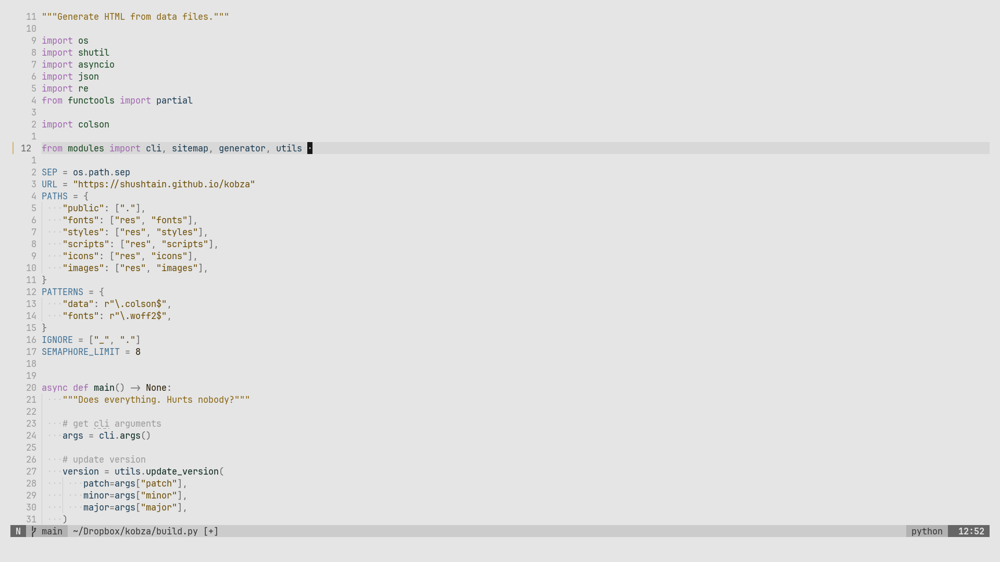

# Farba for Neovim

One theme to have them all.

> "фарба" is a Ukrainian word for paint.  
> Has to be of German origin, right?




## Features

- By default, it's just a standard theme (see screenshots).
- Colors are `cterm` inspired: gray, red, green, yellow, blue, magenta, cyan.
- You can change hue and saturation for different highlight groups:
  - General (this is primarily about UI/editor).
  - Status (errors, warnings, successes, diffs).
  - Syntax (native, Tree-sitter and LSP highlights).
  - Terminal (have separate terminal colors if you want).

## How does it work?

- Provided hue/saturation pairs are converted to ranges of HEX swatches.
- Conversion is similar to HSL -> HEX, but actually uses Cubehelix, so:
  - Color contrast is the same, no matter you prefer blue or yellow themes.
  - To achieve that, saturation of 100% is actually less than in HSL.
  - You have to set 500% saturation for some colors to get the maximum.
  - Using more than 100% saturation may break color contrast consistency.

## Installation

### Lazy

```lua
{
  "shushtain/farba.nvim",
  lazy = false,
  priority = 1000,
  config = function()
    require("farba").setup()
    vim.cmd("colorscheme farba")
  end,
}
```

## Setup

### Defaults

- Colors are provides with `hue` (0-360) and `saturation` (0-100+) as `{ hue, sat }`.
- `false` means the "general" version will be used.

```lua
require("farba").setup({
  light_mode = false,
  colors = {
    general = {
      gray = { 0, 0 },
      red = { 0, 100 },
      green = { 120, 50 },
      yellow = { 40, 75 },
      blue = { 200, 50 },
      magenta = { 280, 50 },
      cyan = { 150, 50 },
    },
    status = {
      red = false, -- error, diff deleted
      yellow = false, -- warning, diff changed
      green = false, -- success, diff added
    },
    terminal = {
      gray = false,
      red = false,
      green = false,
      yellow = false,
      blue = false,
      magenta = false,
      cyan = false,
    },
    syntax = {
      gray = false,
      red = false,
      green = false,
      yellow = false,
      blue = false,
      magenta = false,
      cyan = false,
    },
  },
})
```

### Example

- To set a color, provide it as `{ hue, sat }`.
  - Invalid values for `general` become `{ 0, 0 }` (gray).
  - Invalid values for other groups use `general`.
- Omitted values use defaults.

```lua
{
  "shushtain/farba.nvim",
  lazy = false,
  priority = 1000,
  config = function()
    -- Here is my light theme.
    -- It's for presenting to people, so I will keep defaults.
    -- Dark yellow is ugly, so I want to use orange.
    local light = {
      light_mode = true,
      colors = {
        general = {
          yellow = { 25, 75 },
        },
      },
    }

    -- Here is my dark theme.
    local dark = {
      colors = {
        -- I don't want any UI colors distracting me.
        general = {
          gray = false, -- since this is not valid, it's the same as { 0, 0 }
          red = false,
          green = false,
          yellow = false,
          blue = false,
          magenta = false,
          cyan = false,
        },
        -- Max color for alerts!!!
        status = {
          red = { 0, 100 }, -- error, diff deleted
          yellow = { 30, 100 }, -- warning, diff changed
          green = { 120, 100 }, -- success, diff added
        },
        -- Not all terminal colors are useful to me.
        terminal = {
          red = { 0, 100 },
          green = { 120, 50 },
          yellow = { 30, 75 },
        },
        -- Neither I nor my theme should be clownish.
        -- Let's do something like Gruvbox or my flowerpot.
        syntax = {
          gray = { 25, 50 }, -- orange comments
          red = { 0, 100 }, -- red errors
          green = { 120, 50 }, -- green for my types and modules
          yellow = { 40, 50 }, -- warm yellow for my literals
          blue = { 90, 50 }, -- warm green for my vars and constants to protect eyes
          magenta = { 120, 50 }, -- green for keywords
          cyan = { 0, 50 }, -- red for functions, but not as bright
        },
      },
    }

   -- Here I detect OS theme.
    local is_light_mode = function()
      -- The actual implementation depends on the OS.
    end

    -- Here I automatically switch themes.
    -- I could also track where I start Neovim from, for instance.
    local scheme = function()
      if is_light_mode then
        return light
      return dark
      end
    end

    require("farba").setup(scheme)
    vim.cmd("colorscheme farba")
  end,
}
```

## Issues

The theme is fresh, and some highlights may not be set in a smart way. Expect future changes with stable overall vibe.

- There is no transparency for now. Have never used it to care to learn to implement it, but we could.
- Plugin support, for now, often relies on sensible fallbacks.

### Floating windows

- Since many plugins treat floating windows differently, it is almost impossible to define a universal rule.
- Since you are more likely to see documentation floats, and, by default, they don't have a border, floats are given a separate, lighter background.
- Plugins like Telescope and Which-key come with borders for some modes that looks better with no background change. These are adjusted.

### Light mode

- Light mode works by simply inverting lightness values, so there may be some untracked issues.
