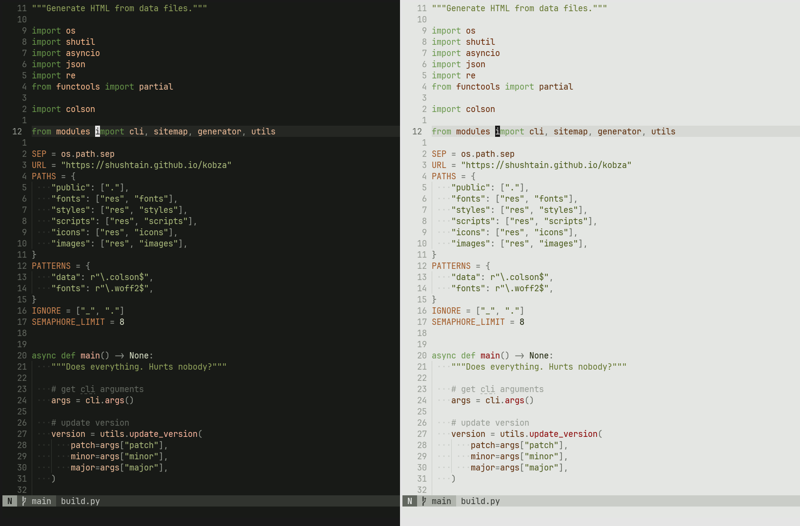
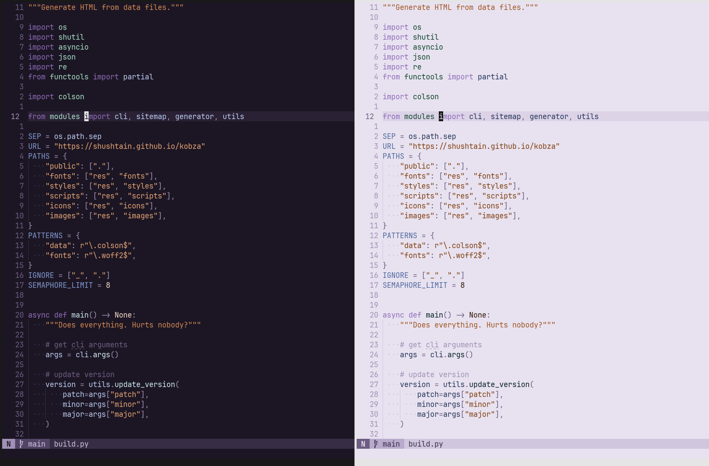
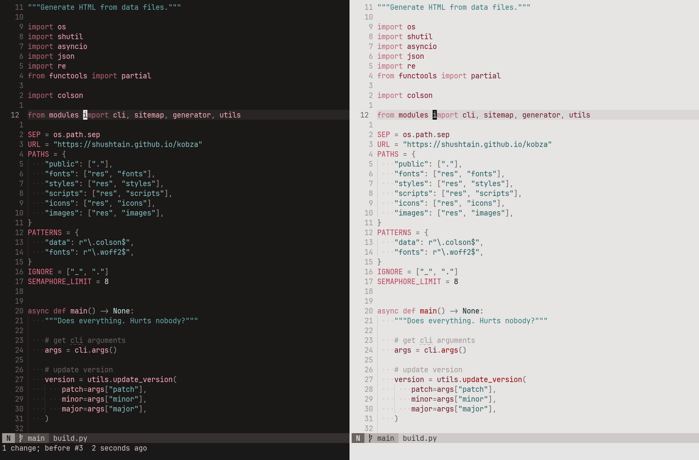
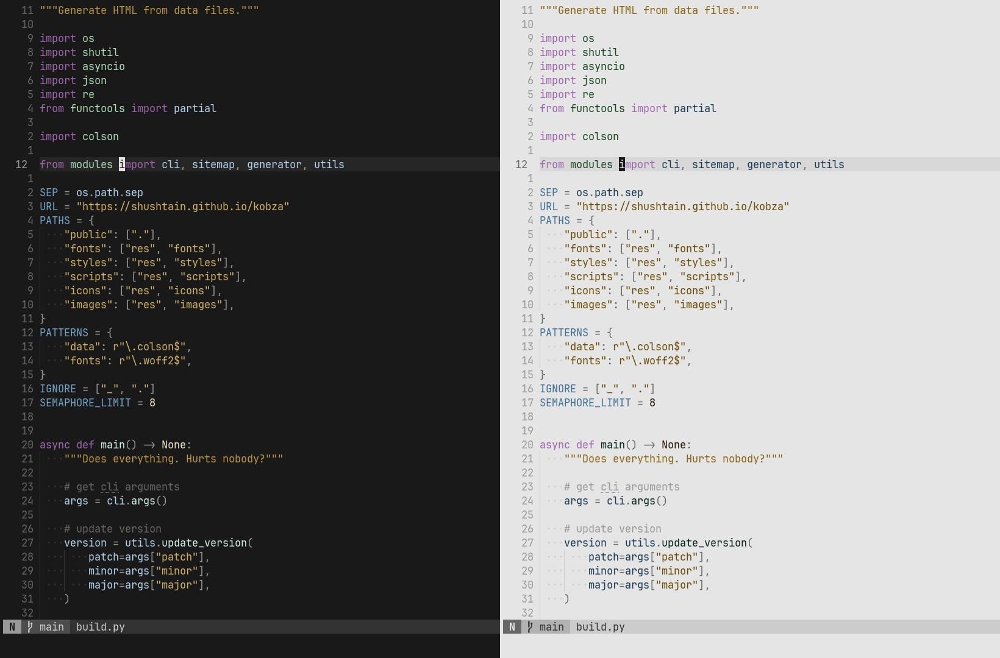

# Farba for Neovim

One theme to have them all.

> "фарба" is a Ukrainian word for paint.  
> Has to be of German origin, right?

## Examples

These are meant to inspire you to mix your own Farba. If you especially like one of them, use the provided color values. Read the [Setup](#setup) section for more details.

### Jungle



```lua
{
  gray    = {  90,   5 },
  red     = {   0, 100 },
  green   = {  20, 100 },
  yellow  = {  70,  50 },
  blue    = {  20,  75 },
  magenta = {  90,  50 },
  cyan    = {   0, 300 },
}
```

### Dream



```lua
{
  gray    = { 260,  25 },
  red     = {   0, 100 },
  green   = { 140,  50 },
  yellow  = {  20,  75 },
  blue    = { 220,  50 },
  magenta = { 260,  50 },
  cyan    = { 180,  50 },
}
```

### Candy



```lua
{
  gray    = {   0,   5 },
  red     = {   0, 100 },
  green   = { 340, 100 },
  yellow  = { 170,  50 },
  blue    = { 340,  75 },
  magenta = { 340,  50 },
  cyan    = { 340, 300 },
}
```

### Default



```lua
{
  gray    = {   0,   0 },
  red     = {   0, 100 },
  green   = {  90,  50 },
  yellow  = {  30,  75 },
  blue    = { 200,  50 },
  magenta = { 300,  50 },
  cyan    = { 150,  50 },
}
```

## Features

- By default, it's just a standard theme (see screenshots).
- Colors are `cterm` aligned: gray, red, green, yellow, blue, magenta, cyan.
- You can change hue and saturation for different highlight groups:
  - General (this is primarily about UI/editor).
  - Status (errors, warnings, successes, diffs).
  - Syntax (native, treesitter and LSP highlights).
  - Terminal (have separate terminal colors if you want).

## Installation

### Lazy

```lua
{
  "shushtain/farba.nvim",
  lazy = false,
  priority = 1000,
  config = function()
    vim.cmd("colorscheme farba")
  end,
}
```

## Setup

Setup is optional and used only to change default config options. If the config table is outside of `setup()` function, use `---@type Farba.Config` to enable LSP help.

### Defaults

- Colors are defined as `{ hue, sat }`, where:
  - `hue` 0-360
  - `sat` 0-100+
- `false` means the "general" version will be used.

```lua
require("farba").setup({
  light_mode = false,
  -- if `false`, make backgrounds transparent
  background = true,
  -- if `false`, don't use separate color for floating windows,
  -- so you could just outline them with 'winborder'
  fill_floats = true,
  colors = {
    general = {
      gray = { 0, 0 },
      red = { 0, 100 },
      green = { 120, 50 },
      yellow = { 40, 75 },
      blue = { 200, 50 },
      magenta = { 280, 50 },
      cyan = { 150, 50 },
    },
    status = {
      red = false, -- error, diff deleted
      yellow = false, -- warning, diff changed
      green = false, -- success, diff added
    },
    terminal = {
      gray = false,
      red = false,
      green = false,
      yellow = false,
      blue = false,
      magenta = false,
      cyan = false,
    },
    syntax = {
      gray = false,
      red = false,
      green = false,
      yellow = false,
      blue = false,
      magenta = false,
      cyan = false,
    },
  },
})
```

### Example

```lua
{
  "shushtain/farba.nvim",
  lazy = false,
  priority = 1000,
  config = function()
    -- Here is my light theme.
    ---@type Farba.Config
    local light = {
      light_mode = true,
      background = false,
      fill_floats = false,
      colors = { general = { yellow = { 25, 75 } } },
    }

    -- Here is my dark theme.
    ---@type Farba.Config
    local dark = {
      colors = {
        -- Everything is grayscale.
        general = {
          gray = false,
          red = false,
          green = false,
          yellow = false,
          blue = false,
          magenta = false,
          cyan = false,
        },
        -- Max color for alerts.
        status = {
          red = { 0, 100 },
          yellow = { 30, 100 },
          green = { 120, 100 },
        },
        -- Essential terminal colors.
        terminal = {
          red = { 0, 100 },
          green = { 120, 50 },
          yellow = { 30, 75 },
        },
        -- Gruvbox-like syntax.
        syntax = {
          gray = { 25, 50 },
          red = { 0, 100 },
          green = { 120, 50 },
          yellow = { 40, 50 },
          blue = { 90, 50 },
          magenta = { 120, 50 },
          cyan = { 0, 50 },
        },
      },
    }

    require("farba").setup(dark)
    vim.cmd("colorscheme farba")
    vim.g.is_theme_dark = true

    vim.keymap.set("n", "<leader>th", function()
      local theme = vim.g.is_theme_dark and light or dark
      require("farba").setup(theme)
      vim.cmd("colorscheme farba")
      vim.g.is_theme_dark = not vim.g.is_theme_dark
    end)
  end,
}
```

## Additional features

If you want to make some additional plugin pretty or just need a color from the Farba palette somewhere else, get it from `vim.g.farba`. For example, `vim.g.farba.colors.general.gray.v25`. To see all available colors, call `:lua print(vim.inspect(vim.g.farba))`. Expect `v01`, `v99`, and `v05-95` with step `5` to be available.

## How does it work?

- Provided hue/saturation pairs are converted to the ranges of HEX swatches.
- Conversion is similar to HSL -> HEX, but actually uses Cubehelix, so:
  - Color contrast is the same, no matter you prefer blue or yellow themes.
  - To achieve that, saturation of 100% is actually less than in HSL.
  - You have to set 500% saturation for some colors to get the maximum.
  - Using more than 100% saturation may break color contrast consistency.

## Credits

- [Dave Green's Cubehelix](https://people.phy.cam.ac.uk/dag9/CUBEHELIX/#Paper)
- [Base16](https://github.com/chriskempson/base16), for inspiring me.
- Countless beautiful themes, for code examples and general approach.
